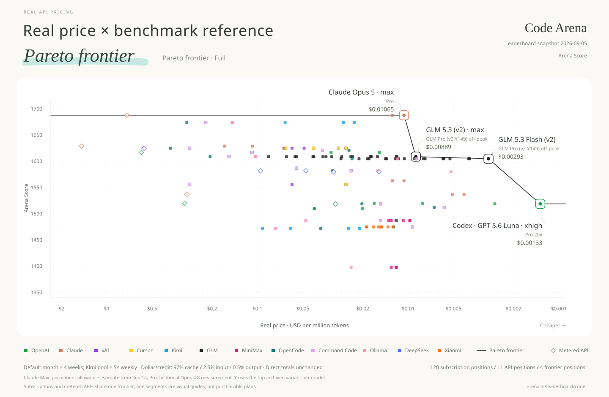
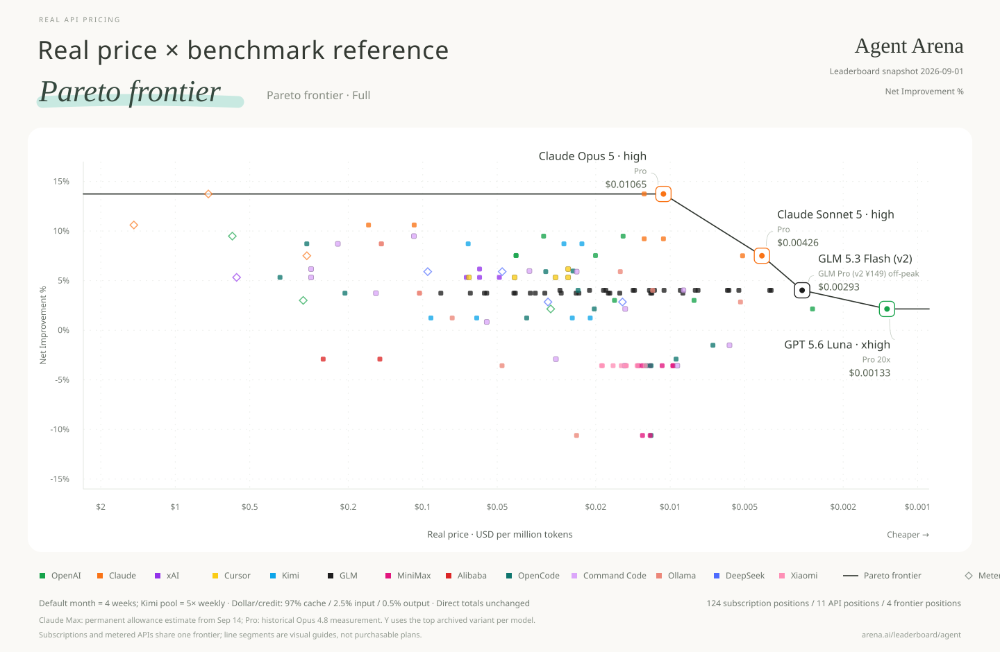
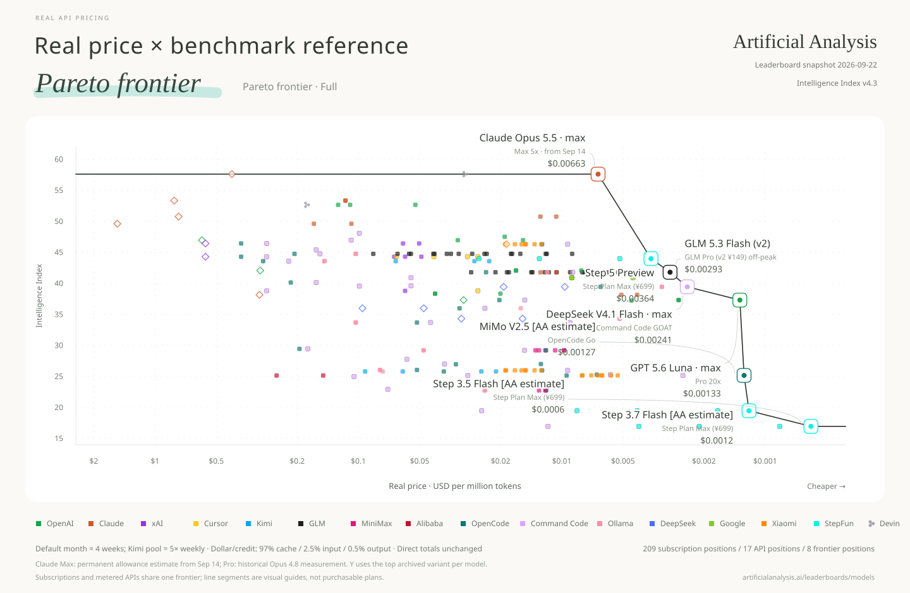
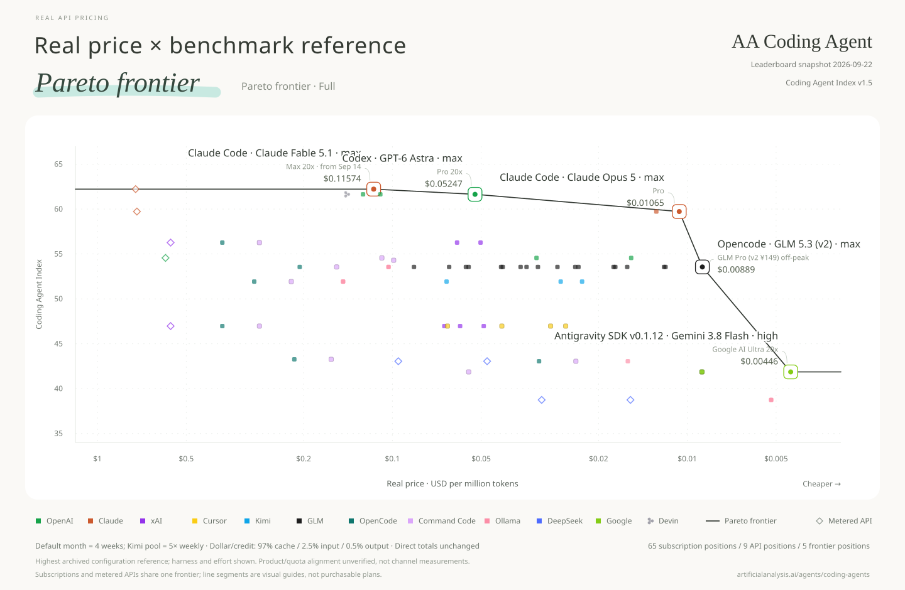
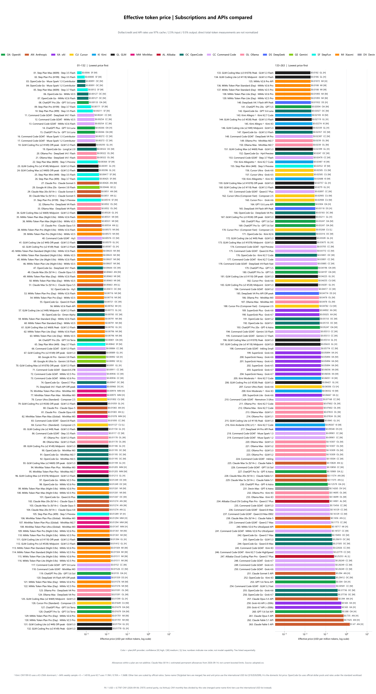
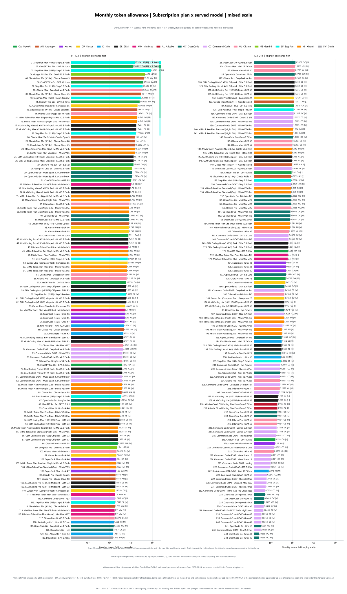

**English** | [中文](README.zh.md)

# Real API Pricing

**Real unit price = monthly subscription fee ÷ monthly usable tokens.**

Full data, one chart per leaderboard. Logarithmic price axis: cheaper to the right. Month = four weeks of saturated use; input, output and cache tokens are included.

**[All charts: English / 中文, SVG / PNG](charts/README.md)**

[English files](charts/en/) · [中文文件](charts/zh/)

English charts are shown below; each chart links to both languages.

## Code Arena

[English SVG](charts/en/pareto/pareto-code-arena.svg) · [中文 SVG](charts/zh/pareto/帕累托_CodeArena榜.svg) · [English PNG](charts/en/pareto/pareto-code-arena.png) · [中文 PNG](charts/zh/pareto/帕累托_CodeArena榜.png)

## Agent Arena

[English SVG](charts/en/pareto/pareto-agent-arena.svg) · [中文 SVG](charts/zh/pareto/帕累托_AgentArena榜.svg) · [English PNG](charts/en/pareto/pareto-agent-arena.png) · [中文 PNG](charts/zh/pareto/帕累托_AgentArena榜.png)

## AA Intelligence

[English SVG](charts/en/pareto/pareto-aa-intelligence.svg) · [中文 SVG](charts/zh/pareto/帕累托_AA智力榜.svg) · [English PNG](charts/en/pareto/pareto-aa-intelligence.png) · [中文 PNG](charts/zh/pareto/帕累托_AA智力榜.png)

## AA Coding Agent

[English SVG](charts/en/pareto/pareto-aa-coding-agent.svg) · [中文 SVG](charts/zh/pareto/帕累托_AA编程Agent榜.svg) · [English PNG](charts/en/pareto/pareto-aa-coding-agent.png) · [中文 PNG](charts/zh/pareto/帕累托_AA编程Agent榜.png)

## Real price overview / 单价总览

[English SVG](charts/en/overview/real-price-overview.svg) · [中文 SVG](charts/zh/overview/单价总览.svg) · [English PNG](charts/en/overview/real-price-overview.png) · [中文 PNG](charts/zh/overview/单价总览.png)

## Monthly allowance / 月额度总览

[English SVG](charts/en/overview/monthly-allowance-overview-hybrid-scale.svg) · [中文 SVG](charts/zh/overview/额度总览_混合比例.svg) · [English PNG](charts/en/overview/monthly-allowance-overview-hybrid-scale.png) · [中文 PNG](charts/zh/overview/额度总览_混合比例.png)

## Method and reproduction

Scores are not mixed across boards. API points are baselines; the line is the subscription frontier. AA Coding Agent scores describe tested harness × model configurations, with the highest archived configuration used per exact model.

[Build instructions / 构建说明](BUILD.md) · [Data / 数据](data/) · [Sources / 来源与署名](SOURCES.md)

## License and acknowledgements

Original software: [MIT](LICENSE). Data references include [Awesome Coding Plan](https://github.com/mahonzhan/awesome-coding-plan) (CC BY 4.0) and the Caijing article 《Token经济，中国账本》. See [SOURCES.md](SOURCES.md) for attribution, changes and third-party terms.
