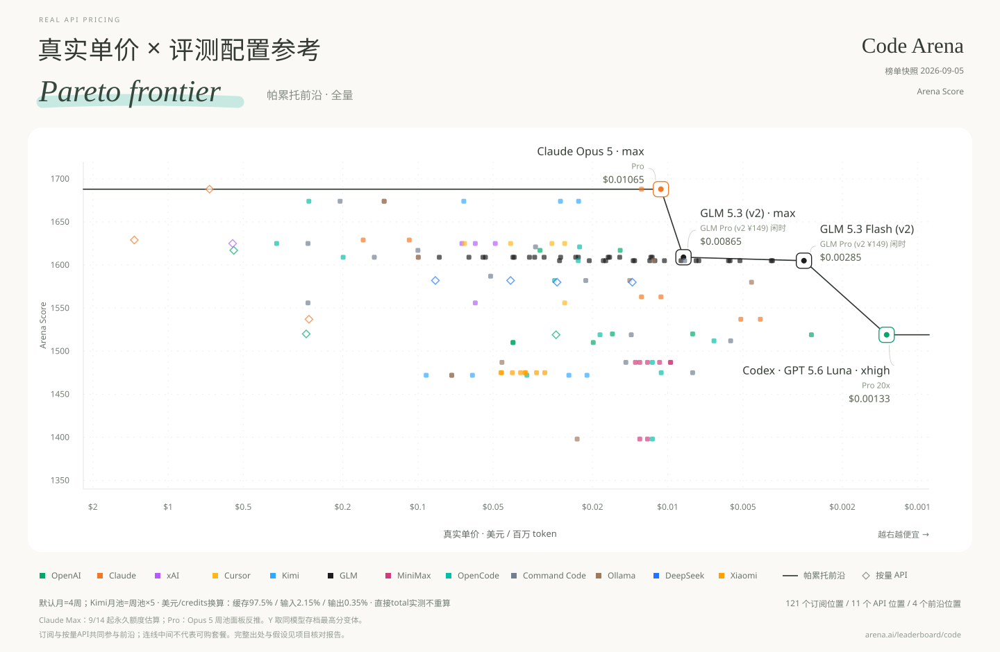
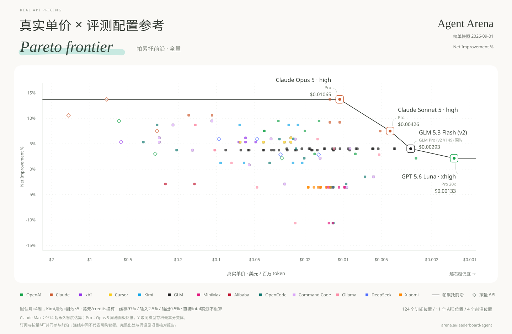
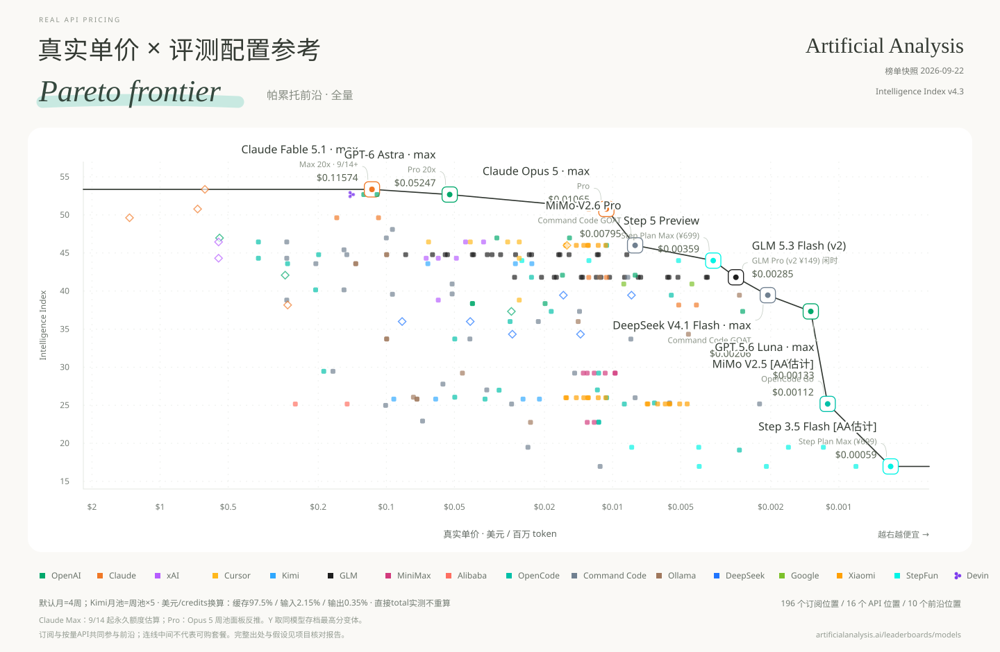
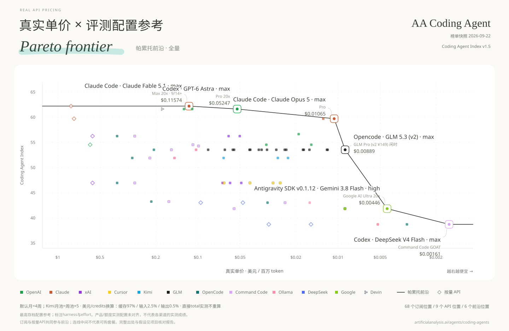
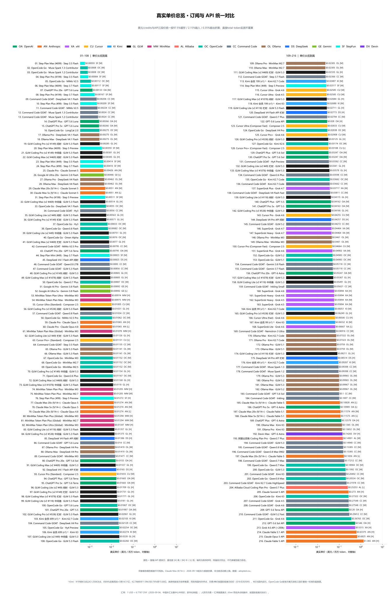
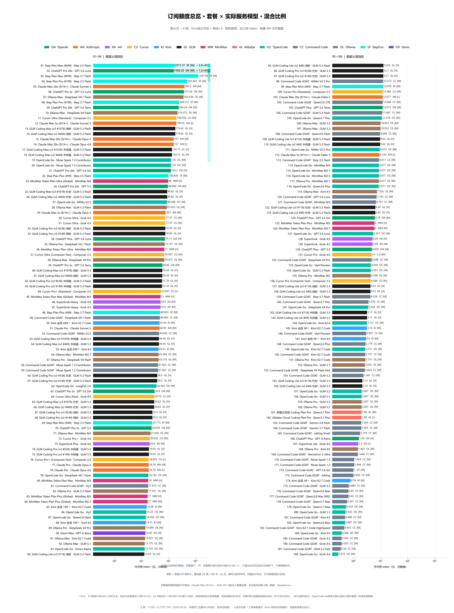

[English](README.md) | **中文**

# 真实 API 定价

**真实单价 = 订阅月费 ÷ 每月实际可用 token。**

每张榜单展示全部有分数据。单价为对数轴，越右越便宜；按饱和使用、每月四周计算，输入、输出与缓存 token 均计入。

**[全部图表：中英文、SVG / PNG](charts/README.md)**

[English files](charts/en/) · [中文文件](charts/zh/)

下方展示中文图，每张图均提供完整的中英文 SVG、PNG 链接。

## Code Arena

[English SVG](charts/en/pareto/pareto-code-arena.svg) · [中文 SVG](charts/zh/pareto/帕累托_CodeArena榜.svg) · [English PNG](charts/en/pareto/pareto-code-arena.png) · [中文 PNG](charts/zh/pareto/帕累托_CodeArena榜.png)

## Agent Arena

[English SVG](charts/en/pareto/pareto-agent-arena.svg) · [中文 SVG](charts/zh/pareto/帕累托_AgentArena榜.svg) · [English PNG](charts/en/pareto/pareto-agent-arena.png) · [中文 PNG](charts/zh/pareto/帕累托_AgentArena榜.png)

## AA Intelligence

[English SVG](charts/en/pareto/pareto-aa-intelligence.svg) · [中文 SVG](charts/zh/pareto/帕累托_AA智力榜.svg) · [English PNG](charts/en/pareto/pareto-aa-intelligence.png) · [中文 PNG](charts/zh/pareto/帕累托_AA智力榜.png)

## AA Coding Agent

[English SVG](charts/en/pareto/pareto-aa-coding-agent.svg) · [中文 SVG](charts/zh/pareto/帕累托_AA编程Agent榜.svg) · [English PNG](charts/en/pareto/pareto-aa-coding-agent.png) · [中文 PNG](charts/zh/pareto/帕累托_AA编程Agent榜.png)

## Real price overview / 单价总览

[English SVG](charts/en/overview/real-price-overview.svg) · [中文 SVG](charts/zh/overview/单价总览.svg) · [English PNG](charts/en/overview/real-price-overview.png) · [中文 PNG](charts/zh/overview/单价总览.png)

## Monthly allowance / 月额度总览

[English SVG](charts/en/overview/monthly-allowance-overview-hybrid-scale.svg) · [中文 SVG](charts/zh/overview/额度总览_混合比例.svg) · [English PNG](charts/en/overview/monthly-allowance-overview-hybrid-scale.png) · [中文 PNG](charts/zh/overview/额度总览_混合比例.png)

## 口径与复现

不同榜单不混分。API 点作为基线，连线为订阅前沿。AA 编程 Agent 分数属于已测试的框架 × 模型配置，同一精确模型取已存档最高分。

[Build instructions / 构建说明](BUILD.md) · [Data / 数据](data/) · [Sources / 来源与署名](SOURCES.md)

## 许可与致谢

原创代码采用 [MIT](LICENSE)。数据参考 [Awesome Coding Plan](https://github.com/mahonzhan/awesome-coding-plan)（CC BY 4.0）及《财经》的《Token经济，中国账本》等。署名、改动和第三方许可见 [SOURCES.md](SOURCES.md)。
