[English](README.md) | **中文**

# 真实 API 定价

AI 编程订阅只标月费，不标每 token 多少钱。本项目把每个套餐折算成真实的每百万 token 单价，再和公开榜单的分数画在一起，看同样的钱哪家买到的能力最多。

**真实单价 = 订阅月费 ÷ 每月实际能用掉的 token。**

**[打开交互网站 →](https://realapipricing.com)** 自选模型、筛选渠道，对比单价和额度，支持中英文。

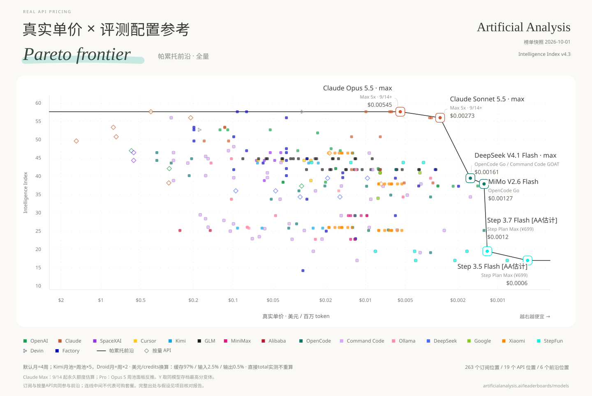

**怎么看图**

- 每个点是一个「套餐 × 实际服务的模型」。横轴是真实单价（美元/百万 token），对数刻度，越往右越便宜；纵轴是该榜单的分数。
- 实心方块是订阅，空心菱形是按量 API 标价，两者在同一条前沿上比较。
- 黑线是帕累托前沿：线上的每个点，都找不到另一个点比它更便宜、分数又更高。
- 订阅单价按用满额度计算。只用掉一半，实际单价就翻倍。

快照日期 <!-- stat:snapshot -->2026-10-02<!-- /stat --> · 共 <!-- stat:points_total -->318<!-- /stat --> 个「套餐 × 模型」点 · [全部图表（中英文、SVG / PNG）](charts/README.md)

## 命令行查询

TypeScript CLI 从本地快照查询，模型、开发公司、访问渠道、套餐分别列出。需要 Node.js 22.12+，在仓库根目录构建：

```sh
npm --prefix cli ci
npm --prefix cli run build
node cli/dist/main.js price --company Anthropic
node cli/dist/main.js allowance --company Anthropic --fee-band 0-30
```

支持筛选、详情、比较以及 JSON/CSV 导出，查询可离线运行。安装本地包见 [CLI README](cli/README.md)，各命令输出见 [命令参考](docs/cli-command-reference.md)。当前版本为 0.1.0，尚未发布到 npm。

仓库提供 [Real Model Price skill](.agents/skills/real-model-price/SKILL.md)，指导 agent 查询价格、月额度和套餐。在加载仓库 skills 的 Codex 会话中，可用 `$real-model-price` 调用，例如：`使用 $real-model-price 比较月费 30 美元以内的 Anthropic 和 Factory 套餐`。

## 数字怎么来的

- **月额度**：饱和使用下每月能用的 token。默认一个月按四周算；厂商另设月池的按厂商口径（Kimi 月池是周池的 5 倍）。输入、输出、缓存 token 全部计入。
- **能实测就用实测**：最好的证据是直接测量，包括面板额度百分比变化对应用掉的 token、本地用量日志、受控跑满，以及官方给出的绝对 token 表。带 token 分项的实测样本先按公开标价折成美元价值、再按渠道负载档换算；缺分项的实测样本和官方 token 表直接用 raw 合计，网页标「未折算」。
- **只能换算时统一口径**：美元额度、credits 额度和 API 标价，统一按一个标准负载折成 token：缓存读取 97%、普通输入 2.5%、输出 0.5%。这是为了横向可比，不代表任何人的真实用法。Anthropic 模型的普通输入份额按缓存写入价计，阶跃和 Google 用低缓存档。详见 [CONVENTIONS.md](CONVENTIONS.md)。
- **闲时优惠**（GLM、DeepSeek、MiMo）单独画成情景点，不取平均。
- **置信度**：每行标 high / medium / low。high 是面板反推、受控实测或官方表；medium 是官方倍率乘一个 high 基准，或多个独立来源量级一致；low 是单一口述或跨档位假设。推算值不会当成实测来写。
- **一个套餐多个模型**：同一套餐下每个模型各占一个点，这些额度是「选一个用」，不能相加。
- **分数**直接取自各榜单，不同榜单不混用。静态图取每个模型存档里的最高配置。
- **促销期不计额度**：套餐临时不计额度的模型画在右端 ≈$0 的专用刻度上。目前有 <!-- stat:points_unmetered -->1<!-- /stat --> 个这样的点：Devin Pro 的 SWE-2，促销到 2026-10-31。

每个采用值的证据和取舍理由见 [DECISIONS.md](DECISIONS.md)，以及 [adopted.csv](data/adopted.csv) 的 `decision_note` 列。

## 分榜帕累托图

每个榜单单独一张图，各用各的分数和快照日期。某榜没有分数的模型不出现在该榜图上，但仍保留在单价和额度数据里。

### AA 智力榜

[SVG](charts/zh/pareto/帕累托_AA智力榜.svg) · [PNG](charts/zh/pareto/帕累托_AA智力榜.png) · [English SVG](charts/en/pareto/pareto-aa-intelligence.svg) · [English PNG](charts/en/pareto/pareto-aa-intelligence.png) · 图见页首

Artificial Analysis Intelligence Index v4.3。新旧版本的分数不能直接比：换版后分数变低，不代表模型变差了。标 [AA estimate] 的是 AA 自己的估计值。

### AA 编程 Agent 榜

[SVG](charts/zh/pareto/帕累托_AA编程Agent榜.svg) · [PNG](charts/zh/pareto/帕累托_AA编程Agent榜.png) · [English SVG](charts/en/pareto/pareto-aa-coding-agent.svg) · [English PNG](charts/en/pareto/pareto-aa-coding-agent.png)

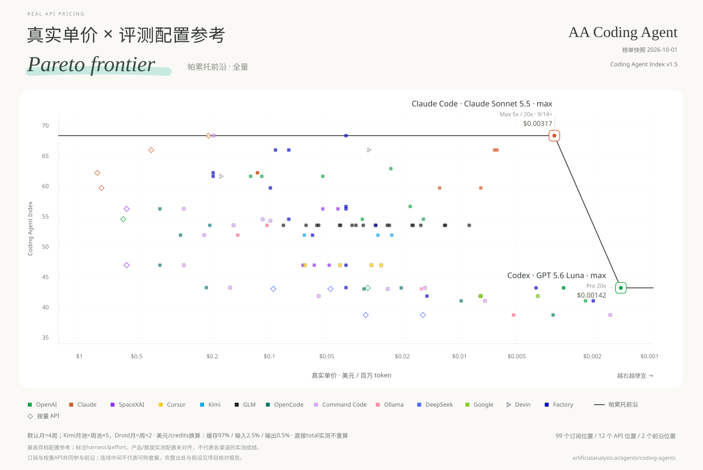

Coding Agent Index v1.5。每个分数对应一组测过的 harness × 模型 × effort。effort 调高不改变每 token 单价，但可能让每个任务多用 token。

### Code Arena

[SVG](charts/zh/pareto/帕累托_CodeArena榜.svg) · [PNG](charts/zh/pareto/帕累托_CodeArena榜.png) · [English SVG](charts/en/pareto/pareto-code-arena.svg) · [English PNG](charts/en/pareto/pareto-code-arena.png)

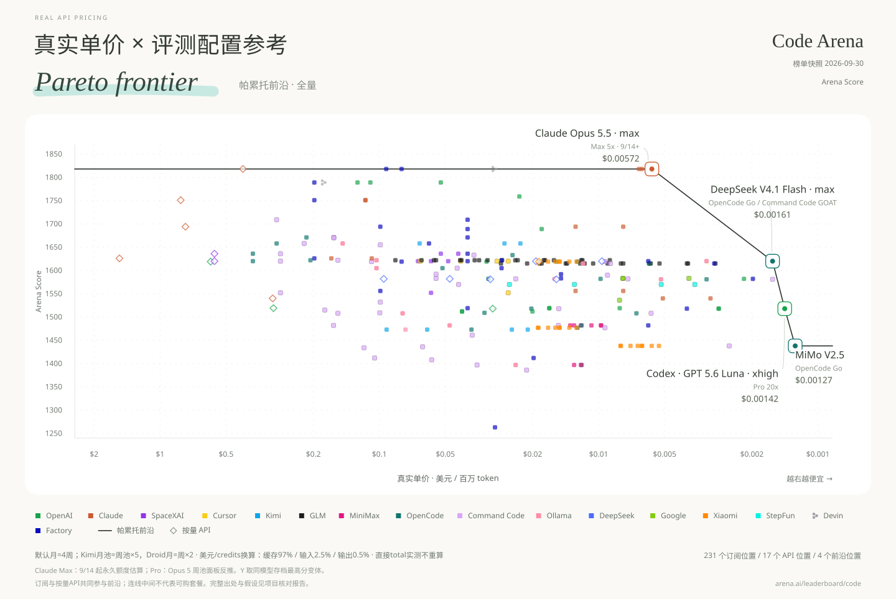

取 WebDev Overall 的 Arena Score，衡量的是做网页应用，不代表通用编程能力。

### Agent Arena

[SVG](charts/zh/pareto/帕累托_AgentArena榜.svg) · [PNG](charts/zh/pareto/帕累托_AgentArena榜.png) · [English SVG](charts/en/pareto/pareto-agent-arena.svg) · [English PNG](charts/en/pareto/pareto-agent-arena.png)

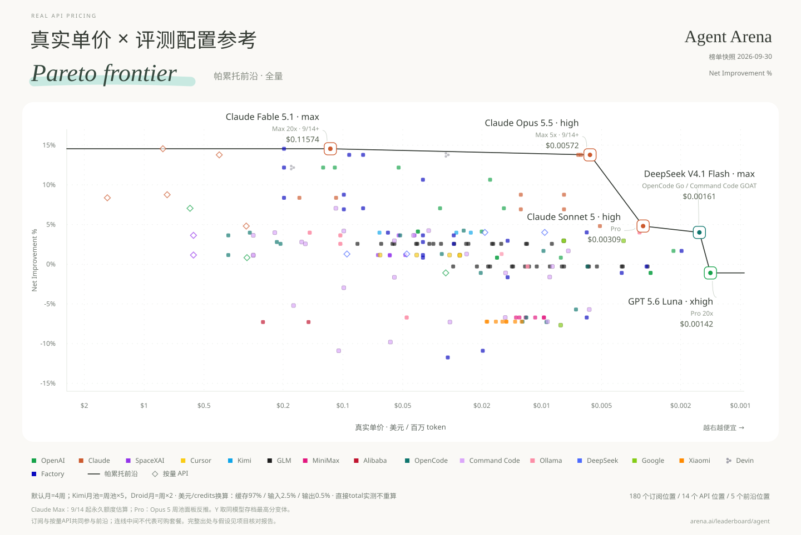

### OpenDesign 设计榜

[SVG](charts/zh/pareto/帕累托_OpenDesign设计榜.svg) · [PNG](charts/zh/pareto/帕累托_OpenDesign设计榜.png) · [English SVG](charts/en/pareto/pareto-open-design-arena.svg) · [English PNG](charts/en/pareto/pareto-open-design-arena.png)

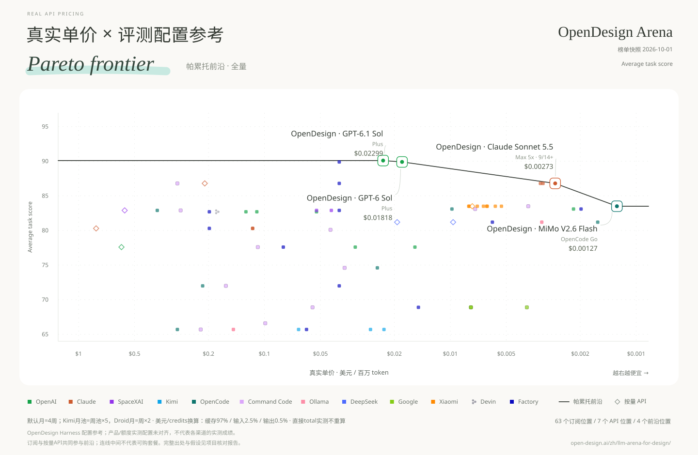

取 0–100 的任务平均分（需求完成度 30 + 设计质量 70），不用它混入成本和速度的推荐分。存档的 <!-- stat:configs_mapped_open_design_arena -->13<!-- /stat --> 个模型全部对上了采用点。

### Terminal-Bench 4.0

[SVG](charts/zh/pareto/帕累托_TB4终端榜.svg) · [PNG](charts/zh/pareto/帕累托_TB4终端榜.png) · [English SVG](charts/en/pareto/pareto-terminal-bench-4.svg) · [English PNG](charts/en/pareto/pareto-terminal-bench-4.png)

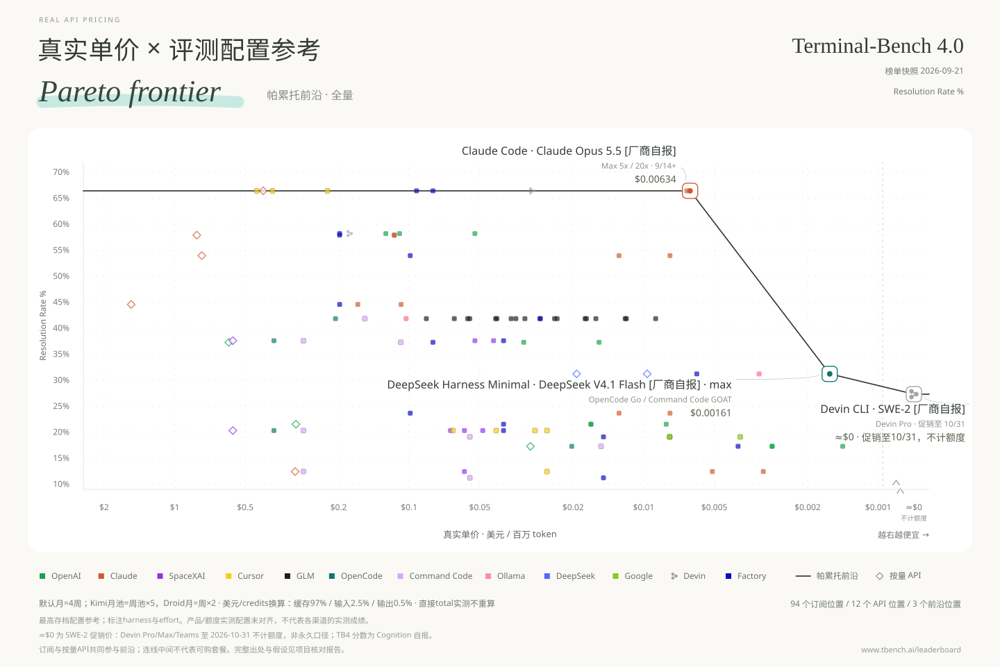

Stanford、Harbor 和 Laude Institute 维护的 66 题官方榜（快照 2026-09-03），<!-- stat:configs_terminal_bench_4 -->22<!-- /stat --> 个公开配置全部收录。官方榜还没收的模型，补上厂商自报分并标 [self-reported]，例如 Cognition 发布博客里 SWE-2 · Devin Pro 的 27.3%。

### Terminal-Bench 4.0（AA）

[SVG](charts/zh/pareto/帕累托_TB4·AA榜.svg) · [PNG](charts/zh/pareto/帕累托_TB4·AA榜.png) · [English SVG](charts/en/pareto/pareto-aa-terminal-bench-4.svg) · [English PNG](charts/en/pareto/pareto-aa-terminal-bench-4.png)

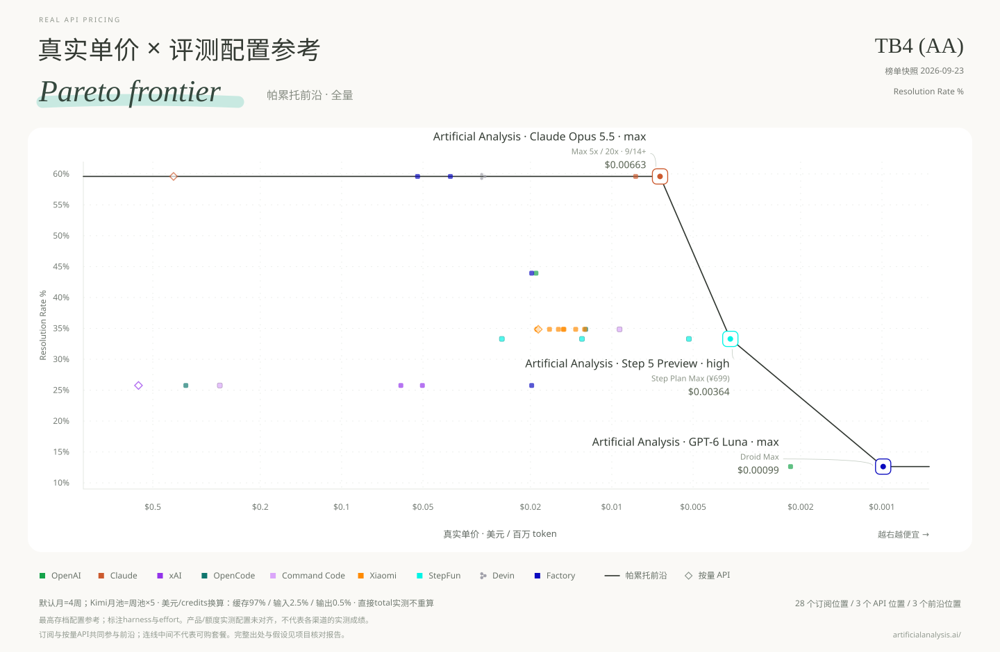

同样 66 道题，由 Artificial Analysis 用自家 harness 跑（快照 2026-09-23）。两个 TB4 榜不能混用：同配置对比，中位差约 2.6 分，个别差得多，比如 Grok 4.7 xhigh 在官方榜 37.58，这里只有 25.76。

### DeepSWE v1.1

[SVG](charts/zh/pareto/帕累托_DeepSWE榜.svg) · [PNG](charts/zh/pareto/帕累托_DeepSWE榜.png) · [English SVG](charts/en/pareto/pareto-deepswe-1-1.svg) · [English PNG](charts/en/pareto/pareto-deepswe-1-1.png)

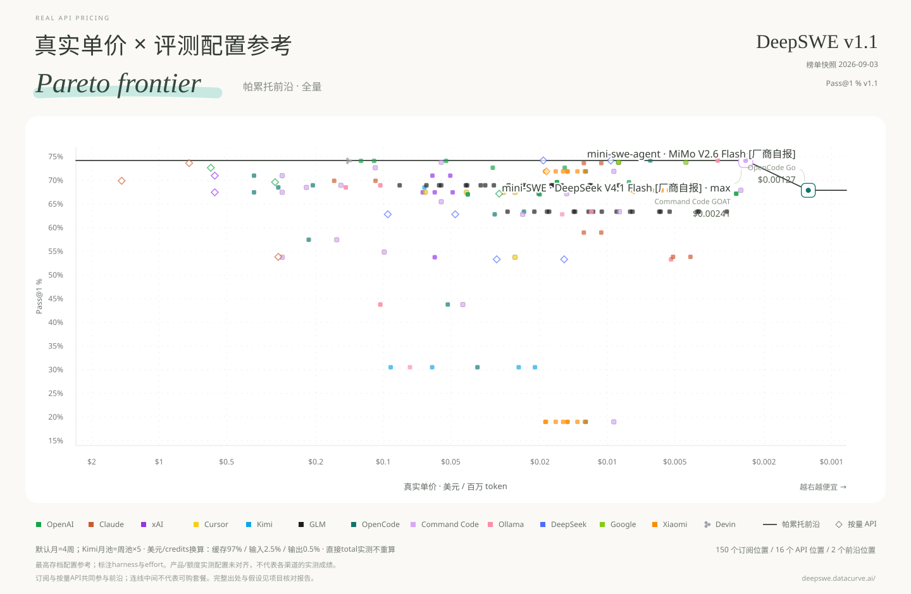

113 题的 Pass@1，官方行统一用 mini-swe-agent 跑（快照 2026-09-03）。厂商自报分作为补充收录，标 [self-reported]。

## 全部套餐的单价与月额度

### 真实单价

全部 <!-- stat:points_priced -->317<!-- /stat --> 个有价格的订阅和 API 点，放在同一把 $/MTok 尺子上。

[SVG](charts/zh/overview/单价总览.svg) · [PNG](charts/zh/overview/单价总览.png) · [数据表](charts/zh/overview/单价总览表.txt) · [English SVG](charts/en/overview/real-price-overview.svg) · [English PNG](charts/en/overview/real-price-overview.png) · [English table](charts/en/overview/real-price-overview-table.txt)

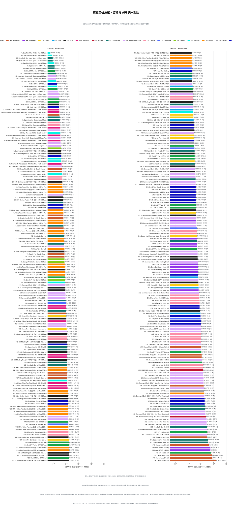

### 月额度

<!-- stat:points_allowance -->298<!-- /stat --> 个有月额度的订阅点，按美元月费分三档，各档单独排序。不分档的全量图和混合比例图见[图表目录](charts/README.md)。

**$0–30** · [SVG](charts/zh/overview/额度总览_月费0-30美元.svg) · [PNG](charts/zh/overview/额度总览_月费0-30美元.png) · [数据表](charts/zh/overview/额度总览表_月费0-30美元.txt) · [English SVG](charts/en/overview/monthly-allowance-overview-fee-0-30-usd.svg) · [English PNG](charts/en/overview/monthly-allowance-overview-fee-0-30-usd.png) · [English table](charts/en/overview/monthly-allowance-overview-fee-0-30-usd-table.txt)

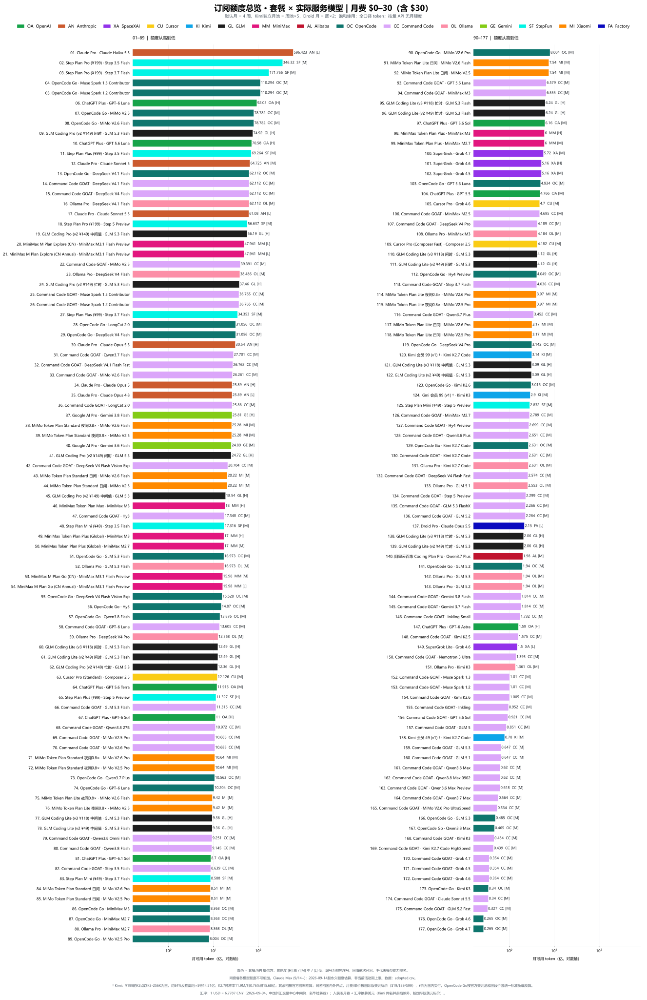

**$30 以上、$100 以内** · [SVG](charts/zh/overview/额度总览_月费30-100美元.svg) · [PNG](charts/zh/overview/额度总览_月费30-100美元.png) · [数据表](charts/zh/overview/额度总览表_月费30-100美元.txt) · [English SVG](charts/en/overview/monthly-allowance-overview-fee-30-100-usd.svg) · [English PNG](charts/en/overview/monthly-allowance-overview-fee-30-100-usd.png) · [English table](charts/en/overview/monthly-allowance-overview-fee-30-100-usd-table.txt)

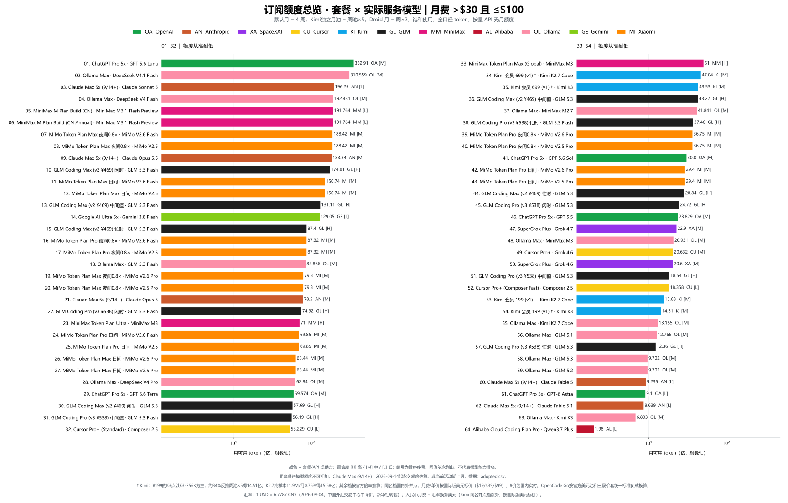

**$100 以上、$300 以内** · [SVG](charts/zh/overview/额度总览_月费100-300美元.svg) · [PNG](charts/zh/overview/额度总览_月费100-300美元.png) · [数据表](charts/zh/overview/额度总览表_月费100-300美元.txt) · [English SVG](charts/en/overview/monthly-allowance-overview-fee-100-300-usd.svg) · [English PNG](charts/en/overview/monthly-allowance-overview-fee-100-300-usd.png) · [English table](charts/en/overview/monthly-allowance-overview-fee-100-300-usd-table.txt)

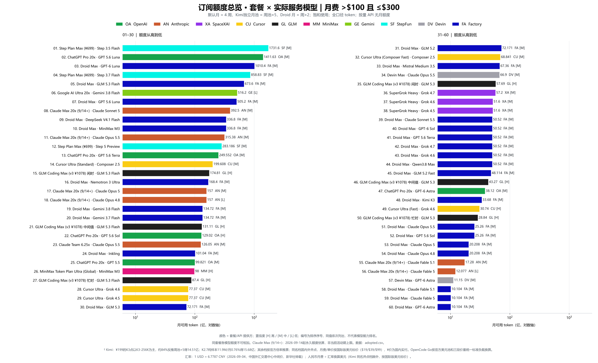

中文图的额度以「亿」为单位，英文图以 billion 为单位（77.37 亿 = 7.737 billion）。

## 数据

| 点 | 数量 |
|---|---:|
| 全部「套餐 × 模型」点 | <!-- stat:points_total -->318<!-- /stat --> |
| 有月额度的订阅 | <!-- stat:points_allowance -->298<!-- /stat --> |
| 促销期不计额度（≈$0） | <!-- stat:points_unmetered -->1<!-- /stat --> |
| 按量 API（标价） | <!-- stat:points_metered -->19<!-- /stat --> |

| 榜单 | 有分点 |
|---|---:|
| AA 智力榜 | <!-- stat:scored_aa_intelligence_index -->268<!-- /stat --> |
| AA 编程 Agent 榜 | <!-- stat:scored_aa_coding_agent_index -->97<!-- /stat --> |
| Code Arena | <!-- stat:scored_arena_code -->178<!-- /stat --> |
| Agent Arena | <!-- stat:scored_arena_agent_mode -->164<!-- /stat --> |
| OpenDesign 设计榜 | <!-- stat:scored_open_design_arena -->88<!-- /stat --> |
| Terminal-Bench 4.0 | <!-- stat:scored_terminal_bench_4 -->111<!-- /stat --> |
| Terminal-Bench 4.0（AA） | <!-- stat:scored_aa_terminal_bench_4 -->36<!-- /stat --> |
| DeepSWE v1.1 | <!-- stat:scored_deepswe_1_1 -->195<!-- /stat --> |

点数最多的几个套餐家族：Command Code GOAT <!-- stat:plans_command_code_goat -->58<!-- /stat --> 个、MiMo Token Plan <!-- stat:plans_mimo_token -->32<!-- /stat --> 个、OpenCode Go <!-- stat:plans_opencode_go -->28<!-- /stat --> 个、Droid Max <!-- stat:plans_droid_max -->27<!-- /stat --> 个、Ollama <!-- stat:plans_ollama -->22<!-- /stat --> 个、Step Plan <!-- stat:plans_step_plan -->12<!-- /stat --> 个。

**下载：** [采用值 CSV](data/adopted.csv) · [计算结果 CSV](derived/points.csv) / [JSON](derived/points.json) · [数据说明](data/README.md) · [分日期原始证据](data/research/)

**全部评测配置**（不只每个模型的最高分）：[评测配置存档](derived/benchmark-configurations.json)（[CSV](derived/benchmark-configurations.csv)）完整保留 <!-- stat:configs_total -->330<!-- /stat --> 条记录，含原始标签、harness、effort、分数区间和任务成本。[套餐与配置的映射](derived/benchmark-points.json)（[CSV](derived/benchmark-points.csv)）有 <!-- stat:refs_total -->1854<!-- /stat --> 条明确对应。不知道的 harness、effort 和区间一律留空，不猜。[全配置交互图](charts/zh/pareto/帕累托交互图.html)可以切换配置和思考强度；需下载后本地打开，Plotly 要联网。

## 已知局限

- 真实单价是下限，前提是额度全部用完。
- 榜单分数是某组 harness × 模型 × effort 的参考值，不是对每个订阅渠道的实测。额度样本用的 effort 和 harness 是否与之一致，尚未核实。
- 分数区间已保留（交互图悬停可见），但暂不参与前沿判定。置信度是定性标签，不是误差范围。
- 来源里的任务成本单独保留，不等于在订阅里跑同一任务的成本。
- 不同厂商分词器的差异没有校正。
- ≈$0 的促销点在促销结束后要重新核对。

## 复现、贡献与致谢

- 从头重建：[BUILD.md](BUILD.md)。口径与换算规则：[CONVENTIONS.md](CONVENTIONS.md)。每个值为什么这么取：[DECISIONS.md](DECISIONS.md)。
- 手上有自己的用量实测（用了多少 token、额度走了百分之几）？欢迎[提交数据 Issue](https://github.com/FeiZhuLulu/real-api-pricing/issues/new?template=contribute-data.md)。
- 原创代码采用 [MIT](LICENSE)。数据参考 [Awesome Coding Plan](https://github.com/mahonzhan/awesome-coding-plan)（CC BY 4.0）及《财经》的《Token经济，中国账本》等。署名、改动和第三方许可见 [SOURCES.md](SOURCES.md)，公开版的脱敏范围见 [PUBLICATION.md](PUBLICATION.md)。
